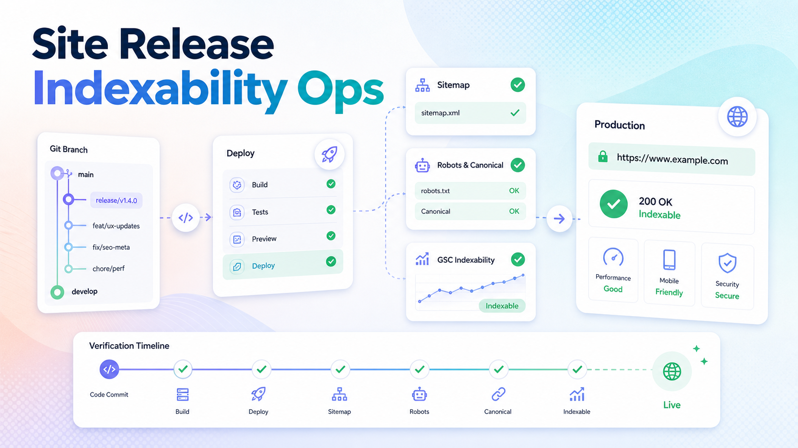
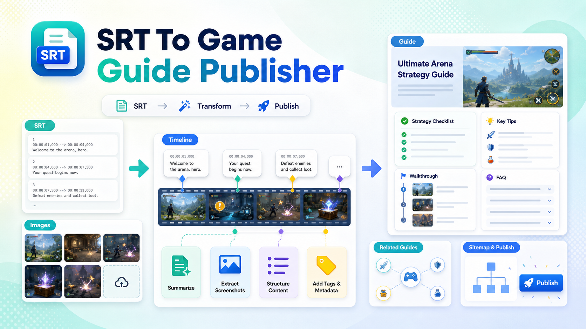
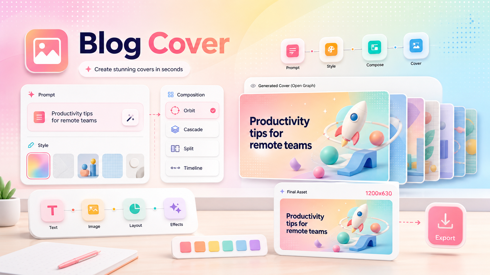

# seoer

English | [中文](./README.zh.md)

`seoer` is a focused Agent Skill collection for people who run SEO content sites with Codex, Claude Code, or other file-capable coding agents.

It packages four repeatable workflows:

- writing and publishing SEO blog articles
- turning SRT/video material into game guides
- generating polished blog cover images
- shipping site changes with deployment and indexability checks

The repository follows a multi-skill layout inspired by `baoyu-skills`: every skill lives under `skills/<skill-name>/SKILL.md`, and each skill can be copied or installed independently.

## Installation

Install the whole collection:

```bash
npx skills add achelie/seoer
```

If you only need one or two skills in a specific project, copy the full skill directories into the project's local skill folder:

```text
<project>/.agents/skills/seo-blog-publisher/SKILL.md
<project>/.agents/skills/site-release-indexability-ops/SKILL.md
<project>/.agents/skills/blog-cover/SKILL.md
```

Install only what you use. Loading unnecessary skills increases context overhead for every agent run.

## Skills

### site-release-indexability-ops



Use this when the work is ready to ship and SEO visibility matters.

Good for:

- committing and pushing site changes
- deploying to Vercel or Cloudflare
- merging branch work into `main` or `master`
- checking production pages, sitemap, robots, canonical, noindex, favicon, `ads.txt`, and GSC-related fixes
- avoiding dirty-tree deployments that accidentally upload local files

Example:

```text
Use $site-release-indexability-ops to commit these blog fixes, deploy production, and verify the changed URLs are indexable.
```

### seo-blog-publisher


Use this for long-tail blog posts, SaaS/tool alternatives, pricing explainers, and comparison articles.

Good for:

- official-source research
- product screenshots and unique article images
- Reddit/customer-research sections
- "best for", "not for", migration cost, free plan, and pricing-limit analysis
- Article/FAQ/Breadcrumb JSON-LD
- sitemap and related-post updates
- final deployment with `$site-release-indexability-ops`

Example:

```text
Use $seo-blog-publisher to write a 3000-word article for "open source ElevenLabs alternatives" with official screenshots, unique images, Reddit complaints, migration cost, and production deployment.
```

### srt-to-game-guide-publisher



Use this when a guide starts from subtitles, gameplay screenshots, or a folder of video assets.

Good for:

- cleaning auto-generated SRT files
- extracting tactics, builds, tiers, names, numbers, and mistakes
- using every provided image exactly once
- creating long-form game guides instead of transcripts
- adding guide metadata, dates, related guides, FAQ/Article JSON-LD, and sitemap entries
- shipping the finished guide

Example:

```text
Use $srt-to-game-guide-publisher on this folder. The SRT is the main source, all images must be used, the guide should be SEO-friendly, and it should be deployed after publishing.
```

### blog-cover



Use this for Gumloop-inspired pastel covers and other SaaS/SEO editorial Open Graph images.

Good for:

- AI tool and SaaS alternatives covers
- pricing and usage-limit covers
- developer workflow covers
- SEO suite and help desk comparison covers
- avoiding repetitive compositions across a blog series
- generating a 1200x630 project-ready cover asset

Example:

```text
Use $blog-cover to generate a 1200x630 pastel SaaS cover for this article. Make it different from the last cover and avoid real product UI.
```

## Recommended Combinations

- Blog article from idea to live URL: `$seo-blog-publisher` + `$blog-cover` + `$site-release-indexability-ops`
- Game guide from subtitles to live URL: `$srt-to-game-guide-publisher` + `$site-release-indexability-ops`
- Release cleanup or GSC issue: `$site-release-indexability-ops`
- Cover refresh only: `$blog-cover`

## Repository Layout

```text
seoer/
  README.md
  README.zh.md
  LICENSE
  screenshots/
  skills/
    blog-cover/
      SKILL.md
      agents/openai.yaml
    seo-blog-publisher/
      SKILL.md
      agents/openai.yaml
    site-release-indexability-ops/
      SKILL.md
      agents/openai.yaml
    srt-to-game-guide-publisher/
      SKILL.md
      agents/openai.yaml
```

## Notes

- The public skill names do not include slashes. Use `site-release-indexability-ops`, `seo-blog-publisher`, `srt-to-game-guide-publisher`, and `blog-cover`.
- The README may refer to them as `achelie/<skill-name>` for discovery and GitHub context.
- These skills are process guides. They do not replace live verification. Pricing, licensing, search results, GSC state, and deployment status should be checked at execution time.

## License

MIT
